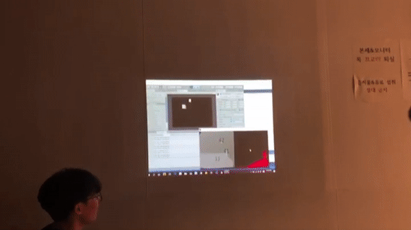

## Ballplaying - Interactive Game
- 2018-2 "캡스톤디자인"
- 개발기간 : 18년 9월 ~ 18년 12월 
- 역할 : Blob Detection, Blob Tracking 구현. Depth 카메라를 이용해 특정 거리 범주에 있는 물체만 인식하고 물체의 좌표를 추출
- 성과 : 교내 Art&Technology Contest 최우수상

## My Role

## Demo

## 참고
프로젝트에 대한 자세한 내용은 ['Ballplaying'](https://github.com/Hongiee2/Uncomfortable_eyes-media-art/blob/master/HCI2019CreativeAward%20%EC%A7%80%EC%9B%90%EC%84%9C_%EC%84%B8%EC%A2%85%EB%8C%80%ED%95%99%EA%B5%90%20%EB%B6%88%ED%8E%B8%ED%95%9C%20%EC%8B%9C%EC%84%A0%ED%8C%80.doc)에 기록해두었습니다.
